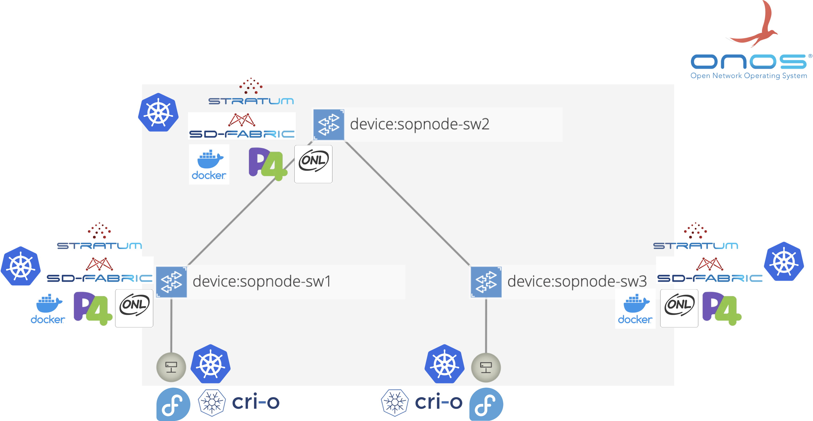

# Hands-on: SD-Fabric, k8s-infrastructure @ Sophia Node

The objective of today is to deploy the following fully functionnal SD-Fabric
environement in the SophiaNode.



To unify the deployment and make it reproducible we automate it with Ansible.

Before deploying our stack on the actual hardware, it is better to test it in a
sandbox.

## Launching the sandbox
We provide a sandbox based on Vagrant that emulates the network core of the
SophiaNode with virtualbox.

Visit [https://github.com/sopnode/sopnode_emu](https://github.com/sopnode/sopnode_emu)
and follow the instructions to setup the sandbox on your machine.

The sandbox emulates the p4 programmable switches with BMv2 and offers an
Ansible box.

You should now have 4 boxes running:
 * `ansibleC` (`192.168.34.2`) that gives offers ansible
 * `sw1` (`192.168.34.3`) that emulates the `sopnode-sw1` switch
 * `sw2` (`192.168.34.4`) that emulates the `sopnode-sw2` switch
 * `sw3` (`192.168.35.5`) that emulates the `sopnode-sw3` switch

## Retrieve the playbooks

If you followed the instruction above, you should be in the `AnsibleController`
directory of the sandbox.

Clone (or download) [https://github.com/sopnode/fabric](https://github.com/sopnode/fabric) into this directory

```bash
git clone https://github.com/sopnode/fabric.git
```

Cloning the repository in this directory makes it available in the `/vagrant`
directory of the Ansible box.

Connect to the Ansible box by running the following command.

```bash
vagrant ssh
```

You are now in the Ansible box, let's go in the fabric directory that we just
cloned:

```bash
cd /vagrant/fabric
```

## Deploy SD-Fabric

From within the Ansible box, follow the instructions of [https://github.com/sopnode/fabric/blob/main/README.md](https://github.com/sopnode/fabric/blob/main/README.md).

If everything goes well, once all the steps are done, you should have SD-Fabric
deployed on your sandbox.

To check it, open a web browser and visit
[http://192.168.34.3:30081/onos/ui](http://192.168.34.3:30081/onos/ui). This
will give you access to the GUI of ONOS. The login is `onos` and the password is
`rocks`.

